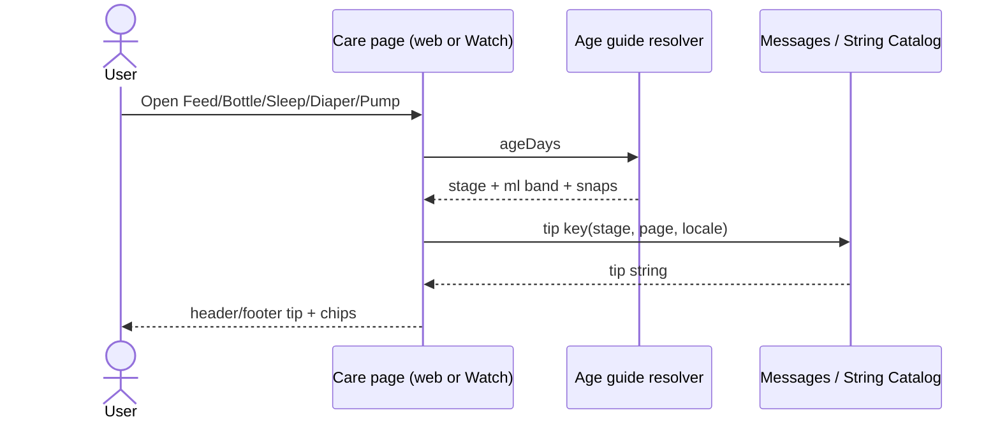

# Design: essay-recs-align

**Updated:** 2026-09-24  
**Mode:** simple · main-thread fallback (Design Task usage limit)

## Decision options

### Option 1 — Essay stage tables mirrored in TS + Swift *(recommended)*
- **What it is:** Remap my-apps feed/sleep tip bands to essay numbers; add Watch `CareGuide` stage resolver + String Catalog EN/VI; chips from essay snaps.
- **Example:** ageDays 120 → m3_6 → bottle tip mid-band 150–210; Watch Sleep tip “14–15 hours…” (VI when locale vi).
- **Pros:** Matches Decision 2; works offline/sample; no API.
- **Cons:** Dual maintenance (mitigate with shared fixture numbers in tests).

### Rejected alternative
GraphQL tip payload / shared JSON codegen — better long-term single source, but Watch API not wired and tooling exceeds this simple run.

**Recommendation:** Option 1.

---

## Locked defaults (from Analyze Qs)

1. **m1_3 bottle split:** ageDays 31–60 → 90–120 ml; 61–90 → 120–150 ml (essay).
2. **Newborn chips:** 30–60 ml (essay bottle line); colostrum stays essay text only, not chip band.
3. **Watch locale:** system locale via String Catalog (`en`, `vi`).

## Essay → operational map (source of truth)

| Stage | ageDays | Bottle ml / bottle feeds | Breast sessions/day | Sleep tip (total) | Diaper | Pump tip |
|-------|---------|--------------------------|---------------------|-------------------|--------|----------|
| newborn | 0–30 | 30–60 / 7–8 | 8–12 | 16–18 h; awake 45–60m | NB &lt;5kg | 30–90; 8–10× |
| m1_3a | 31–60 | 90–120 / 6–8 | 6–8 | 14–16 h | S 4–8kg | 90–150; 6–8× |
| m1_3b | 61–90 | 120–150 / 6–8 | 6–8 | 14–16 h | S | same |
| m3_6 | 91–182 | 150–210 / 5–6 | 5–6 | 14–15 h | M 6–11kg | 120–180; 4–6× |
| m6_12 | 183–364 | 180–240 / ~3–4* | (milk on demand; tip optional) | 12–14 h | L 9–14kg | 150–220; 3–4× |
| m12_24 | ≥365 | milk 350–500/day† | (supplement; tip optional) | 11–14 h | XL/XXL | 1–2× |

\* Essay milk 500–700 ml/day at 180–240/feed → ~3–4 for bottle `feedsMax` only.  
† Toddler: per-feed chip band (e.g. 120–180) for logging; tip states **daily** milk 350–500 — chips ≠ full-day milk.

**Split counts (required):** `FEED_GUIDE_BANDS.feedsMin/Max` = **bottle** progress only. Breast footer uses **essay breast session** ranges by `babyCareGuideStageForAge` (stage keys or dedicated breast feed min/max — not bottle band).

Diaper/pump footer keys stay `newborn|m1_3|m3_6|m6_12|m12_24`.

---

## System design

### Overview
- **Actors:** Caregiver (Watch / web), local guide resolvers (no new server).
- **my-apps:** `babyFeedGuideForAge` / `babySleepGuideForAge` / stage footers read remapped bands + i18n.
- **Watch:** `ageDays` on snapshot → `CareGuideStage` → localized tip strings + `snapsForAge` → existing chips/footer slots.
- **Consistency:** Same stage day cuts; same essay ml numbers; tip wording short (Watch) vs essay long-form unchanged on web guidelines block.
- **Failure:** null/missing age → no fake “recommended” snaps (`noBirthSnaps` usability only); empty tips OK.
- Point to sequence + contracts below (no API/DB).

### Concept 1 — Local guide resolver
Client owns age→stage→tip/chip; essay long-form remains separate reference UI on web only.

---

## Design patterns used

### 1. Stage lookup table
- **What:** Ordered maxDay → band (existing `FEED_GUIDE_BANDS` shape).
- **How:** Replace band numbers; Swift enum + parallel table.
- **Why:** Repo already uses this; easy tests.
- **Best practice:** Don’t invent a second stage cut function — share day thresholds with `babyCareGuideStageForAge` (m1_3 tip stage still one key; feed ml may sub-split).

### 2. String Catalog / message keys
- **What:** EN+VI tip keys by stage and page.
- **How:** Web `messages/baby/*`; Watch `Localizable.xcstrings`.
- **Why:** Matches product i18n; system locale on Watch.
- **Best practice:** Short tip strings; full essay stays `home.guide.*`.

### 3. History-first chip builder
- **What:** Existing `buildBabyBottleChipMls` / `BabyBottleChipMls`.
- **How:** Only change **snaps** input from essay band.
- **Why:** Preserve caregiver habit of recent ml.
- **Best practice:** limit 3 on Watch unchanged.

---

## Sequence diagram

---

## API contracts

**N/A** — Has API = no.

## Database contracts / example queries

**N/A** — Has DB = no.

---

## UI / UX / mobile

- **Web:** Same chrome; tip/chip content changes only; guidelines essay unchanged except VI audit if paste differs.
- **Watch:** Same header / controls / one footer; tips swap by age + locale; no new pages.
- **3AM:** Short tips; numbers match essay so wrist ≠ phone conflict.
- **Hit area / tokens:** unchanged.

---

## Security (OWASP)

| OWASP | Status | Note |
|-------|--------|------|
| A01 Broken Access Control | N/A | No new endpoints |
| A02 Cryptographic Failures | N/A | |
| A03 Injection | pass | Tip strings are constants / format args only |
| A04 Insecure Design | pass | Reference tips — keep caveat; no dosing calculator UI |
| A05 Security Misconfiguration | N/A | |
| A06 Vulnerable Components | N/A | |
| A07 Auth Failures | N/A | |
| A08 Software/Data Integrity | N/A | |
| A09 Logging/Monitoring | N/A | |
| A10 SSRF | N/A | |

---

## Aggressive challenges

- Dual TS/Swift tables will drift — **tests must assert shared fixture numbers**.
- Toddler daily milk vs per-feed chips can confuse — tip copy must say daily milk; chips stay per-bottle.
- Remapping feed bands changes web overdue/`feeds today` — update tests deliberately.
- VI essay paste may need `home.guide.*` refresh — only if audit finds drift (task).

## Clear for Gate B?

Design ready for design-review → TDD review → Gate B.
