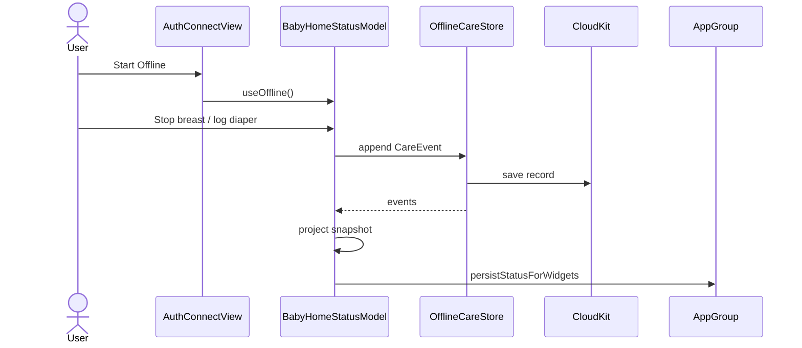

# Design: offline-icloud-mode

**Mode:** full  
**Has API:** no · **Has DB:** yes  
**Updated:** 2026-09-29  
**Note:** main-thread · Gate A2 approved HTML is Build source of truth

## Decision 1: Offline store technology

### Option 1 — CloudKit CKRecord event log + snapshot projector (recommended)

- **What it is:** Private CloudKit database; append `CareEvent` records; project to `BabyHomeStatusSnapshot` for UI + App Group.
- **Example:** Stop breast → insert CKRecord `type=CareEvent, kind=breast_stop, …` → reload projection → `persistStatusForWidgets()`.
- **Pros:** Explicit companion contract; works without SwiftData quirks; easy to document record fields.
- **Cons:** More manual sync/error code than SwiftData.

### Option 2 — SwiftData + CloudKit

- **What it is:** `@Model` care events; `ModelConfiguration(cloudKitDatabase: .automatic)`.
- **Example:** Insert `OfflineCareEvent` model; `@Query` / fetch → same projector.
- **Pros:** Less boilerplate; Apple-recommended path for many apps.
- **Cons:** watchOS + CloudKit setup risk; harder to show a plain record contract in docs.

### Recommendation

**Pick Option 1** — clearer Watch-only + companion docs; matches “document the container” Outcome.

## Chosen design (locks + Option 1)

### Connect (match ui-refs)

1. Chips: **Offline | Cloud** (Offline left + **default**).
2. Offline: hide URL + pairing; hint; **Start Offline** → `model.useOffline()`.
3. Cloud: show URL **prefilled** `BabyAPIConfig.localPreset` (`http://127.0.0.1:3000`); pairing; **Save & connect** (existing redeem/live).
4. Remove Local chip and Local-as-default load behavior.
5. `ConnectHostPreset`: UI uses `.offline` / `.cloud` (rename from `.production`); `.local` may remain in tests legacy only.

### Modes

- `CareDataMode`: `.sample` | `.live` | `.offline`
- Offline = connected (`isConnected = true`); no GraphQL client
- Persist last mode in UserDefaults (`baby.care.dataMode`); cold start: restore Offline without token; else live restore; else Connect
- Sample: previews / bypassAuth only — not offered as Connect peer

### Offline store

- Container: **`iCloud.vn.in4.MyBaby`** (provisional lock — match `group.vn.in4.MyBaby` naming; confirm when enabling iCloud capability in Xcode; README must use the enabled id)
- Record type `CareEvent` (v1 fields below)
- Append-only; projector builds snapshot (last feed/nap/diaper/pump, open nap, running timer)
- iCloud unavailable: show error; do not fake “connected success” without durable path (allow local CK cache if CloudKit provides; still surface account errors)
- Live history and Offline history **separate** (no merge this pass)
- Logout from Offline: clear session flag → Connect; **keep** iCloud events (do not wipe CloudKit on logout)

### Widgets

- Still App Group projection only; never tokens; Offline updates snapshot then `persistStatusForWidgets()`

### Build parity

Must match:
- `ui-refs/_proposed-connect-offline.html`
- `ui-refs/_proposed-connect-cloud.html`

## System design

### Overview

- Connect chooses Offline vs Cloud.
- Offline: Watch app → OfflineCareStore (CloudKit private) → projector → `BabyHomeStatusModel.snapshot` → App Group widgets.
- Cloud: existing pair/Keychain → GraphQL → same model snapshot path.
- Boundary: no my-apps Offline API. Future companion apps join same CloudKit container/schema (docs only this pass).

### Concept 1 — Event log → projection

Care chips write events; UI never reads raw CloudKit in views — only snapshot/model.

### Concept 2 — Mode as routing

`mode` switches send path (offline store vs GraphQL) without duplicating chip views.

## Design patterns used

### Pattern 1 — Protocol + fake store for tests

- **What:** `OfflineCareStoring` with in-memory fake in unit tests.
- **How:** Offline path uses CloudKit `OfflineCareStore` implementation.
- **Why:** TDD without network/iCloud account.
- **Best practices:** Inject into model; no singleton-only logic.

### Pattern 2 — Pure snapshot projector

- **What:** `[CareEvent] → BabyHomeStatusSnapshot` pure function.
- **How:** Same rules as live mapper where possible (last events, open nap).
- **Why:** Unit-test Offline status without UI.
- **Best practices:** Keep in `BabyCareShared`.

### Pattern 3 — Connect mode chips (existing chrome)

- **What:** Accent selected chip; plain button style; 44pt height.
- **How:** Reuse `presetButton` pattern from `AuthConnectView`.
- **Why:** Match live Watch + approved HTML.
- **Best practices:** Nested radius; Offline first.

## Sequence diagram



## API contracts

**N/A** — Has API = no.Cloud continues existing `WatchPairClient` + `BabyGraphQLClient` (unchanged contracts).

## Database contracts

### CloudKit (private DB)

| Record type | Field | Type | Notes |
|-------------|-------|------|-------|
| `CareEvent` | `id` | String (UUID) | recordName |
| `CareEvent` | `kind` | String | e.g. `breast_start`, `breast_stop`, `bottle`, `nap_start`, `nap_stop`, `diaper`, `pump_start`, `pump_stop`, `pump_amount` |
| `CareEvent` | `at` | Date/Int64 | event time |
| `CareEvent` | `side` | String? | `l` / `r` / `both` |
| `CareEvent` | `ml` | Int64? | bottle/pump |
| `CareEvent` | `diaperKind` | String? | wet/dirty/… |
| `CareEvent` | `durationSec` | Int64? | timed stops |
| `CareEvent` | `schemaVersion` | Int64 | start at 1 |

Indexes: query by `at` descending for projection window (e.g. last N days / last 500 events).

### Example queries / operations

```text
// Append
CKModifyRecords(save: [CareEvent(...)])

// Load for projection
CKQuery(recordType: "CareEvent", predicate: TRUEPREDICATE, sort: at DESC, limit: 500)

// Projector (pseudo)
snapshot = OfflineSnapshotProjector.make(events: events, ageDays: …, now: now)
```

## UI / UX / mobile

- Match HTML: Offline default; Cloud URL default local preset.
- iCloud error copy plain (Settings / under Start).
- Watch hit targets 44pt.

## Security design review (OWASP)

| Topic | Note |
|-------|------|
| Secrets | Never store API token / pairing in CloudKit or App Group |
| Auth | Offline uses Apple ID / iCloud account — surface unsigned state |
| Injection | Validate enum kinds before write |
| Privacy | Private DB only; care data is sensitive — no public DB |

## Challenges answered

| Challenge | Answer |
|-----------|--------|
| Why not App Group? | Not iCloud; no companion share |
| Why not merge live+offline? | Separate until product asks |
| Why remove Local? | Gate A2 — Cloud + local URL default |

## Has API / Has DB

- **Has API:** no  
- **Has DB:** yes → design-review needs **DB design review** Task; code review SPM includes **db**
