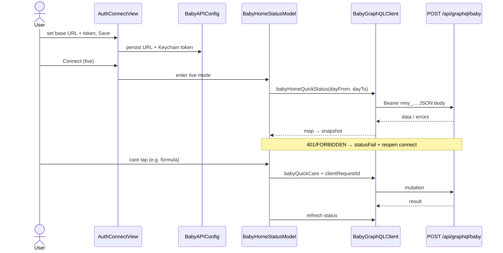

# Design: Configurable API base URL + Watch GraphQL client

**Mode:** simple

## Decision 1: which design approach?

### Option 1 — Config store + thin URLSession GraphQL + live model (recommended)

**What it is:**
Persist base URL (AppStorage) + Bearer token (Keychain). Extend connect UI with URL presets + fields. Thin `BabyGraphQLClient` POSTs to `{base}/api/graphql/baby`. Live mode loads `babyHomeQuickStatus` into `BabyHomeStatusSnapshot` and sends `babyQuickCare` on care taps; sample/bypass remains.

**Example:**
User picks preset Local → `http://127.0.0.1:3000`, pastes `mny_…`, Save → Connect. App fetches status; formula 120 ml → mutation with new `clientRequestId`.

**Pros:**

- Matches Decision 1 Option 2 and `BABY_API.md` Watch MVP
- Testable without Apollo
- Keeps existing care UI / snapshot

**Cons:**

- Watch typing is awkward (mitigate with presets)
- First live wiring is non-trivial (map + errors + ATS)

**Rejected alternative (≤3 lines):** Settings-only URL with no client — rejected by Decision 1 Option 2. Apollo/codegen client — too heavy for this run.

## Tradeoffs

Simple mode: one recommended path. Cost is medium (client + UI + tests); usability depends on presets; failure domain is network/auth, not care-page layout.

## Recommendation

**Pick Option 1** — only approach that delivers editable base URL **and** live GraphQL without inventing REST or a new server.

## Chosen design (user-approved)

Option 1 — Config store + thin URLSession GraphQL + live model (Gate B 2026-09-24).

## System design

### Overview

- **Boundaries:** Watch UI → `BabyAPIConfig` + Keychain → `BabyGraphQLClient` → my-apps `POST /api/graphql/baby`. Sample path never leaves device.
- **Data ownership:** Server owns care events; Watch owns timers UI + config secrets; snapshot is a local projection of status.
- **Request path:** See Sequence. Endpoint always `{normalizedBase}/api/graphql/baby`.
- **Consistency:** After successful `babyQuickCare`, refresh status (or apply openSleep from result then refresh). Unknown network → retry same `clientRequestId`.
- **Failure domain:** Bad URL/token → connect/status error; care pages stay usable in sample mode.
- **Scale:** Single user, ~60 RPM server limit; no Watch fan-out.

### Concept 1 — Sample vs Live mode

- **What:** `live` when valid base URL + token saved and user connects; else sample.
- **How:** `ContentView` gate; model holds optional client.
- **Why:** Safe demo without server; clear upgrade path.
- **Best practices:** Default preview/bypass stays sample; never log token.

## Design patterns used

### Pattern 1 — Protocol client (test seam)

- **What:** `BabyGraphQLClienting` with `execute(document:variables:)`.
- **How:** Production `URLSession` impl; tests use stub returning fixtures.
- **Why:** Unit-test URL building + decode without network.
- **Best practices:** Inject into model; no singleton secret reads inside views.

### Pattern 2 — Config value object

- **What:** `BabyAPIConfig` normalizes origin, builds GraphQL URL, validates.
- **How:** Pure helpers + persistence wrapper.
- **Why:** One place for slash/path rules; avoids hardcoded hosts in call sites.
- **Best practices:** Store origin only; append `/api/graphql/baby` at request time.

### Pattern 3 — Snapshot mapper

- **What:** Map GraphQL status JSON → `BabyHomeStatusSnapshot` (+ tips via existing `CareGuide`).
- **How:** Pure function in shared or Watch Models.
- **Why:** UI stays snapshot-driven.
- **Best practices:** Prefer `summary` strings from API; derive ageDays from `birthDate` when present.

## Sequence diagram



Timer starts stay local (no API). Stops and one-shot logs use mutations per **Live care call rules**.
## API contracts

**Has API = no** (no server change). Client consumes existing contract.

| Call | Method + path | Auth | Notes |
|------|---------------|------|-------|
| Status | `POST {BASE}/api/graphql/baby` | Bearer `mny_` + Baby grant | Query `BabyHomeQuickStatus` — fields per `BABY_API.md` §8 |
| Quick care | same | write scope | Mutation `BabyQuickCare` — `clientRequestId` required; retry same id on unknown failure |

**Client config (local):**

| Field | Storage | Rules |
|-------|---------|-------|
| `baseURL` | AppStorage / UserDefaults | Absolute http(s) origin; trim trailing `/`; reject empty / relative |
| `apiToken` | Keychain | `mny_…`; never log; clear on disconnect optional |

**Default base URL:** No invented production host. Preset **Local** = `http://127.0.0.1:3000`. Preset **Production** clears to empty TextField — user must paste real `https://…` origin before live connect.

## Database contracts

**N/A — Has DB = no.** No my-apps schema. Local Keychain + UserDefaults only.

## Example queries / documents

Status (align with `BABY_API.md` / `BABY_HOME_QUICK_STATUS_QUERY`):

```graphql
query BabyHomeQuickStatus($dayFrom: String!, $dayTo: String!) {
  babyHomeQuickStatus(dayFrom: $dayFrom, dayTo: $dayTo) {
    lastFeed { id type at endedAt payload summary }
    lastSleep { id type at endedAt payload summary }
    lastDiaper { id type at endedAt payload summary }
    lastPump { id type at endedAt payload summary }
    openSleep { id type occurredAt endedAt }
    feedsToday
    birthDate
    latestWeightKg
    recentBottleMl
  }
}
```

Mutation: use `BABY_API.md` §7 minimal `BabyQuickCare` document.

Day window: local midnight → next local midnight (port of `babyLocalDayWindow` idea).

## UI / UX / mobile

- Extend `AuthStubView` → connect screen: current URL, presets (**Local** = `http://127.0.0.1:3000`; **Production** = empty field — user pastes real https origin), URL field, token field, **Save & connect**, **Continue with sample**.
- **Reachability:** App entry uses `bypassAuth: false` so connect shows when not connected. Previews keep `bypassAuth: true`. Care home always has a **Settings** control to reopen connect (edit URL/token) even after sample/live.
- Errors: short statusFail / connect banner (“Bad URL”, “Unauthorized”, “Network”).
- watchOS: large hit targets; presets first; token paste-friendly.
- ATS: HTTPS preferred for user Production URL; Local preset is http for simulator; add narrow ATS only if Build needs device→LAN HTTP.

## Live care call rules (locked)

| User action | Live mode | Sample mode |
|-------------|-----------|-------------|
| Breast/pump timer **start** (idle→running) | Local timer only — **no** mutation | Local only |
| Breast/pump timer **stop** (running→done) | `babyQuickCare` BREAST / pump duration via `breastRunning` + side | Local flash only |
| Formula / pump amount / diaper | `babyQuickCare` FORMULA / PUMP_AMOUNT / DIAPER | Local flash + side effects |
| Sleep chip toggle | `babyQuickCare` SLEEP | Local nap phase + side effects |
| After successful mutation | Refresh `babyHomeQuickStatus` (or apply `openSleep` then refresh) | n/a |
| Unknown network failure | Retry **same** `clientRequestId` + body once (or until user Retry) | n/a |

## OWASP (Top 10 — relevant rows)

| Risk | Plan |
|------|------|
| A01 Broken access | Bearer token with Baby grant; no cookie session on Watch |
| A02 Crypto | Keychain for token; do not store token in UserDefaults/logs |
| A03 Injection | JSON body via encoder; no string-concat GraphQL from free text beyond URL host validation |
| A04 Insecure design | User-chosen URL can point anywhere — validate URL shape; HTTPS preferred; show host clearly |
| A05 Misconfig | ATS: avoid blanket `NSAllowsArbitraryLoads`; prefer exceptions only if required |
| A07 Auth failures | Map 401/FORBIDDEN to reconnect UI |
| A09 Logging | Never log Authorization header or token |

## Aggressive challenges

- Typing full URLs on Watch is painful — presets + optional deep link later.
- Mapping GraphQL → snapshot may miss tip/header sentences — use CareGuide + summaries.
- Live care taps without offline queue — accept “failed” footer + retry same clientRequestId.
- Parallel WIP on care pages — touch model/auth paths carefully.

## Has API / Has DB

- **Has API:** no
- **Has DB:** no
