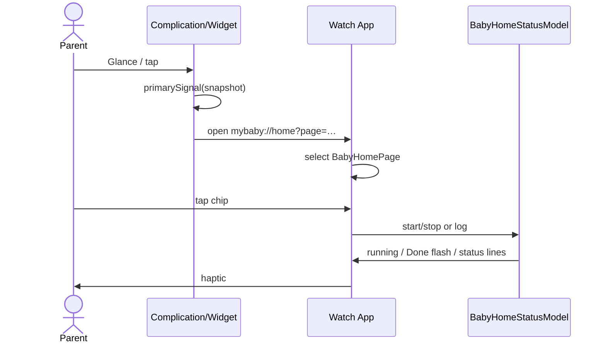

# Design: Watch Baby Care multipage home + companions

**Mode:** full
**Updated:** 2026-09-23
**Has API:** no
**Has DB:** no

## Decision 1: which design approach?

### Option 1 — Shared Swift files + sample status (UI-first)

**What it is:**
Watch app target + new Widget Extension. Compile the same `BabyHomeStatusModel` (and signal priority helpers) into both targets. Sample snapshots for previews and runtime until GraphQL. No App Group required for MVP.

**Example:**
`BabyHomeView` pages bind to `@StateObject` / `@Observable` sample model; `BabyCareWidget` `TimelineProvider` calls `BabyHomeStatusSnapshot.sampleOpenNap()` / `.sampleNextFeed()`.

**Pros:**
- Fastest path to UI parity + companion previews
- No entitlement / provisioning blockers
- Matches “UI-first / sample OK” ask

**Cons:**
- Live face and app can diverge until App Group or API sync
- Duplicate compile of shared files (manage membership carefully)

### Option 2 — Shared framework + App Group from day one

**What it is:**
`BabyCareKit` framework + App Group `UserDefaults` / file for status; widgets always read the same store the app writes.

**Example:**
App writes `status.json` on timer tick; widget timeline reloads from App Group.

**Pros:**
- True shared live status early
- Cleaner module boundary

**Cons:**
- More Xcode setup (signing, App Group)
- Slower for UI-first pass; overkill before auth/API

## Tradeoffs

| Factor | Option 1 | Option 2 |
|--------|----------|----------|
| Cost / time | Lower | Higher |
| Complexity | Low | Medium |
| Usability | Full UI + sample companions | Same + live sync |
| Failure cases | Widget stale vs app until API | Entitlement / Group misconfig |

## Recommendation

**Pick Option 1** because Gate A2 and the prompt prioritize UI parity and sample-driven companions. Add App Group when wiring `BABY_API.md` Bearer + `babyHomeQuickStatus`.

## Chosen design (user-approved)

**Option 1** — Shared Swift files (`BabyCareShared`) + sample status; Widget Extension embedded in Watch app. Gate B approved 2026-09-23.

## System design

### Overview

- **Runtime shape:** Watch app process (UI + local timers) and Widget extension process (timeline reads). Both link shared status types/helpers (Option 1: target membership, not a separate process IPC yet).
- **Data ownership:** `BabyHomeStatusModel` owns in-app UI state (timers, Done flash, pending footer). Widgets own ephemeral timeline entries derived from `BabyHomeStatusSnapshot` samples (later: App Group / network).
- **Trust boundary:** Auth stub in-app only; no secrets in widgets. Future Bearer token stays in Keychain on Watch/iPhone — not in this pass.
- **Consistency:** Companion priority function is pure and shared (`primarySignal(snapshot)`). App and widgets must call the same helper.
- **Failure domains:** Network N/A (sample). UI pending recovery is local only. Widget failure → show last timeline entry / placeholder.
- **Scale:** One baby profile sample; no multi-baby.

### Concept 1 — Shared snapshot, two presenters

App presents multipage controls; widgets present one primary signal. Both read the same snapshot shape so copy and priority never fork. Sequence + contracts below; do not duplicate field lists here.

## Design patterns used

### Pattern 1 — Observable status model (MVVM-lite)

- **Where:** `BabyHomeStatusModel` + page views
- **Shape:** Model holds timers/status; views are thin; widgets use immutable `Snapshot`
- **Why:** Keeps chip state and companion signal aligned
- **Avoid:** Business rules only in View bodies

### Pattern 2 — Page TabView navigation

- **Where:** `BabyHomeView`
- **Shape:** `TabView(selection:)` + `.tabViewStyle(.page)`; enum `BabyHomePage`
- **Why:** Gate A2 multipage swipe
- **Avoid:** Nesting all jobs in one `List`

### Pattern 3 — Pure signal priority

- **Where:** `BabyCarePrimarySignal.resolve(snapshot)`
- **Shape:** nap → overdue feed/diaper → next feed → last care
- **Why:** Single rule for complications + small widget
- **Avoid:** Per-family if/else copy

## Sequence diagram

## API / DB contracts

**N/A this pass** (Has API no, Has DB no).

**Future (do not implement now):** GraphQL `POST /api/graphql/baby` + Bearer `mny_…` per `/Users/ptquang86/ws/my-apps/docs/BABY_API.md` — `babyHomeQuickStatus`, `babyQuickCare`. Map actions: BREAST / FORMULA / SLEEP / DIAPER / PUMP_AMOUNT.

**Example queries:** N/A (sample model). Snapshot fields for Build:

| Field | Use |
|-------|-----|
| `babyAgeTitle` | `Baby Care · 4 months` |
| `nextFeed` / `feedOverdue` | Feed header |
| `openNapStartedAt` | Sleep + companions |
| `bottleChipMls` | default `[60, 90, 120]` (+ Custom) |
| `lastFeed/Nap/Diaper/Pump` lines | Last care + medium widget |
| `primarySignal` | complications / small |

## UI / UX / mobile (Watch)

Aligned with Gate A / 01b — do not re-argue 80/20:

| Page | Content |
|------|---------|
| 1 Feed+Bottle | Breast L/R chips; Bottle ml chips + Custom; Crown scroll if needed; one footer owner |
| 2 Sleep | Start/End timed chip; optional Custom behind More |
| 3 Diaper | 2×2 Wet/Poop/Mixed/Dry — UI labels; API later maps Poop → `dirty` |
| 4 Pump | Pump L/R + ml chips |
| 5 Last care | Four icon + sentence rows |

**Feed+Bottle footer:** one slot for the whole page. Owner priority mirrors web: pending recovery for the active control family first (breast vs bottle), never tip + recovery stacked.

Tokens: light/dark teal system from 01b. Haptics on save and timer start/stop. Auth stub separate from home.

**Bottle ml default (sample):** `[60, 90, 120]` from web `BABY_BOTTLE_CHIPS_NO_BIRTH_SNAPS`; Custom adds more.

## OWASP (Watch UI-first)

| Risk | Mitigation |
|------|------------|
| A01 Broken access | No remote API yet; stub gate only |
| A02 Cryptographic failures | No tokens stored this pass |
| A03 Injection | N/A — no SQL/network payloads |
| A04 Insecure design | Deep links only open known page enum |
| A05 Misconfig | URL scheme registered; no debug secrets in widgets |
| A07 Auth failures | Stub; do not invent cookies |
| A08 Integrity | Sample data; later use `clientRequestId` idempotency |
| A09 Logging | No PII logs in widgets |
| A10 SSRF | N/A |

## Aggressive challenges

- Feed+Bottle density on small faces — mitigate with vertical stack + Crown
- Sample widgets teach wrong “live” expectation — README must say sample until API
- Page rename Feed vs Breast — deep-link `feed` documented in README

## README (deliverable)

Map web Breast+Bottle → Watch page 1; Nap→Sleep; etc. How to add complication / Smart Stack. Note sample status.
