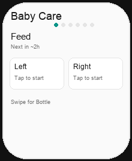
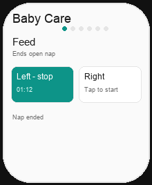

# UI concept (UI/UX designer): watch-care-rules-feed-split

**Result:** done
**Updated:** 2026-09-23
**Has UI:** yes

## Sources followed

| Source | Applied? | Notes |
|--------|----------|-------|
| Project DESIGN_GUIDE / AGENTS UI | missing in Watch repo | Use `BabyTokens` |
| `clean-minimal-ui` | yes | Teal accent, hairline, 8/6 radius |
| Existing UI patterns | yes | `CarePages`, `CareControls`, prior `watch-baby-care-home` |

## Concept depth

**lean** — page split + subtle type + care side-effect parity (behavior not a new chrome system)

## Align with Gate A (80/20)

| Item | From 01a / idea | How concept honors it |
|------|-----------------|------------------------|
| Important info/action #1 | Care chips | Feed page = breast only; Bottle page = ml only |
| Important info/action #2 | Section lead + detail | Lead `.headline`; subtle detail smaller (`.caption2`) |
| Secondary | Custom ml sheet | Unchanged sheet |
| Top user journey | Open → page → one tap | Same; Feed then Bottle adjacent |
| Sensible defaults | Land on Feed | `BabyHomePage.feed` first |

## Screen / surface map

| Surface | Purpose | Primary actions |
|---------|---------|-----------------|
| Page 1 · Feed | Breast L/R only | Start / stop / switch breast |
| Page 2 · Bottle | **2 recommended ml + Custom** | Pick amount / Custom |
| Page 3 · Sleep | Nap | Start / stop (unchanged chrome) |
| Page 4 · Diaper | Kinds | Log kind |
| Page 5 · Pump | L/R + **2 recommended ml + Custom** | Pump (does **not** auto-end nap) |
| Page 6 · Last care | Status | Glance |

## Page order (proposed — Gate A2)

1. **Feed** (breast)
2. **Bottle**
3. Sleep
4. Diaper
5. Pump
6. Last care

Deep links: `page=feed` → Feed; `page=bottle` → Bottle; legacy `breast` → Feed.

## UI reference images (required for Gate A2)

**Fidelity:** Token-matched concept drafts (same colors/radii as `BabyTokens`). **Replace with Simulator screenshots after Build** before Gate C.

| Surface | Variant | File path | Source | Shown at Gate A2? | Confirmed at Gate B? |
|---------|---------|-----------|--------|-------------------|----------------------|
| Feed page | light | `.my-docs/workflow/watch-care-rules-feed-split/ui-refs/01-feed-page-light.png` | concept-draft | yes | |
| Bottle page | light | `.my-docs/workflow/watch-care-rules-feed-split/ui-refs/02-bottle-page-light.png` | concept-draft | yes | |
| Feed ends nap | light | `.my-docs/workflow/watch-care-rules-feed-split/ui-refs/03-feed-ends-nap-light.png` | concept-draft | yes | |

Replace-after-build: run Watch App Simulator → capture Feed, Bottle, Feed-with-open-nap→tap.

### Previews

## Layout / hierarchy

1. **No app title** — do not show `Baby Care · {age}` (Gate A2 lock). No `.navigationTitle` with age string.
2. Page dots (6 pages) — system TabView page style is enough
3. `CareSectionHeader`: **lead** bold; **detail/subtle** smaller muted (`.caption2`, not `.caption`)
4. Controls for that page only
5. One footer slot (recovery → fail → tip)

## Bottle / Pump ml chips (locked intent)

- **Count:** exactly **2** recommended ml values + **Custom** (Watch; tighter than web’s 3 + Custom).
- **Values:** same algorithm as my-apps `buildBabyBottleChipMls` in `lib/baby-age-guide.ts`:
  - Prefer distinct `recentBottleMl` (history) first
  - Then fill from age-band snaps (`babyFormulaSnapList(band)`) when birth known, else `BABY_BOTTLE_CHIPS_NO_BIRTH_SNAPS` `[60, 90, 120]`
  - Use **`limit: 2`** on Watch
- Pump amount chips reuse the same list as Bottle (web parity: `pumpChipMlsBase = bottleChipMlsBase`).

## Interaction notes (parity with web)

- Breast / bottle / diaper while nap open → end nap locally (match quick-care non-pump)
- Pump L/R / pump ml → leave nap running
- Bottle / diaper / sleep → stop running breast timer; pump amount does not stop breast
- No ScrollView inside page TabView

## Out of scope

- GraphQL wire-up; web home changes; widget redesign
