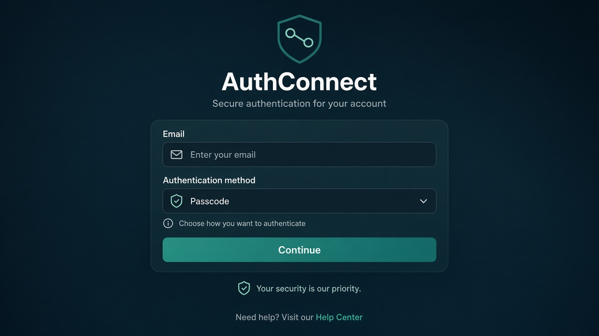
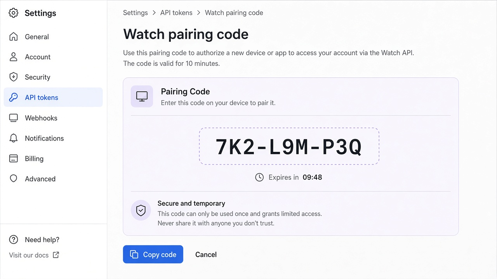

# UI concept (UI/UX designer): watch-connect-presets-pairing

**Result:** done  
**Updated:** 2026-09-26  
**Has UI:** yes  
**Note:** main-thread fallback — usage limit; lean concept

## Sources followed

| Source | Applied? | Notes |
|--------|----------|-------|
| Project DESIGN_GUIDE / AGENTS UI | yes (web) | my-apps quiet/teal for Settings pairing panel |
| `clean-minimal-ui` skill | yes | Teal accent, quiet hierarchy |
| Existing Watch patterns | yes | Extend `AuthConnectView` / `BabyPalette` — do not invent new chrome |
| Existing web patterns | yes | Near `ApiTokenSettings` / Settings API tokens |

## Concept depth

**lean** — one Watch connect surface + one web pairing strip.

## Align with Gate A (80/20)

| Item | From 01a / idea | How concept honors it |
|------|-----------------|------------------------|
| Important #1 Watch | Pairing code + Connect | Code field above Save & connect |
| Important #2 Watch/Web | Presets + host; web Generate code | Local/Production row; web large code display |
| Secondary | Advanced paste; sample | Disclosure / caption under primary |
| Top journey | Web code → Watch enter → live | Two surfaces only |

## Screen / surface map

| Surface | Purpose | Primary actions |
|---------|---------|-----------------|
| Watch `AuthConnectView` | Connect live or sample | Enter code; Local preset; Save & connect; sample |
| Web Settings — Watch pairing | Mint short code for Watch | Generate code; show code + expiry |

## UI reference images (required for Gate A2)

**Fidelity note:** Both images are **concept drafts** (GenerateImage). Real Watch chrome is `AuthConnectView` (`BabyPalette`, caption host, Local/Production buttons, fields). Real web chrome is Settings + `ApiTokenSettings`. **Replace with real screenshots after Build** (Watch sim + Settings page) before Gate C.

| Surface | Variant | File path | Source | Shown at Gate A2? |
|---------|---------|-----------|--------|-------------------|
| Watch connect (pairing primary) | dark | `ui-refs/01-watch-connect-pairing-concept.png` | concept-draft | yes |
| Web Watch pairing panel | light | `ui-refs/02-web-watch-pairing-concept.png` | concept-draft | yes |

**Replace-after-build:** Watch simulator `AuthConnectView` + Settings `#settings-api-tokens` with pairing strip.

Markdown previews:

## Layout concept (plain words)

### Watch connect (extend existing)

1. Title **API server**
2. Current host caption (muted)
3. Preset row: **Local** | **Production** (Option 1)
4. **Pairing code** field (Option 5 — primary)
5. **Save & connect**
6. **Continue with sample**
7. Secondary: **Advanced: paste URL & token** (collapsed / disclosure)

### Web Settings

- Card **Watch pairing** under/near API tokens
- Large code, expiry, **Generate code**
- Short help: enter on Apple Watch (laptop OK; no iPhone required)

## Components to reuse

| Component / pattern | Where | Use for |
|---------------------|-------|---------|
| `AuthConnectView` | `BabyHomeView.swift` | Watch connect |
| `BabyAPIConfig` presets | `BabyCareShared` | Local / Production |
| `ApiTokenSettings` / Settings section | my-apps | Host web pairing strip |
| Field / Button / Modal | `components/ui/` | Web mint UI |

## Empty / loading / error

| State | Behavior |
|-------|----------|
| Empty code | Disable or error “Enter pairing code” |
| Bad/expired code | Short banner: Invalid or expired — generate a new code on web |
| Web before generate | Empty + Generate CTA |
| Sample | Unchanged continue path |

## A11y / hit targets

- Watch buttons ≥44pt hit feel; code field large
- Web: visible labels; code selectable; button not icon-only without name

## Out of scope for concept

- Care home page redesign
- QR / iPhone companion
- Changing GraphQL care UI

## Result

**done** — lean Watch + web concept drafts for Gate A2. Human must approve look intent; accept replace-with-real-screenshots after Build.
