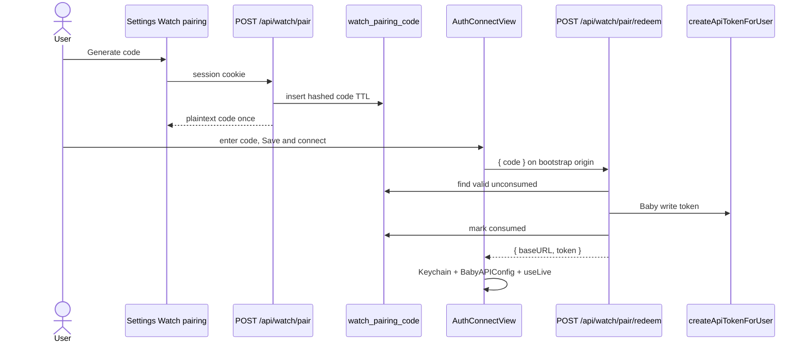

# Design: Watch connect — presets + short pairing code

**Mode:** full  
**Has API:** yes · **Has DB:** yes  
**Note:** main-thread fallback — usage limit. Gate A2 approved. Analysis Decisions 1–2 locked as recommended.

## Decision 1: which design approach?

### Option 1 — Pairing table + REST mint/redeem + Watch code-first connect (recommended)

**What it is:**  
my-apps: `watch_pairing_code` table; session-auth **mint**; public rate-limited **redeem** creates Baby `mny_…` and returns `{ baseURL, token }`. Watch: Production/bootstrap origin + Local preset; primary **pairing code** field; advanced paste secondary. Web: Settings Watch pairing card.

**Example:**  
Laptop Settings → Generate → `AB7K2Q`. Watch Production → enter code → Save & connect → Keychain + live GraphQL.

**Pros:**

- Matches Gate A/A2 and Option 1+5
- Reuses `createApiTokenForUser`
- No iPhone

**Cons:**

- New API + migration
- Bootstrap origin must be configured for Production

### Option 2 — Deep link / clipboard-only (no server pairing)

**What it is:**  
Keep paste/deep link; no mint/redeem server.

**Example:** Mac copy `mny_…` → Watch paste.

**Pros:** Less backend work  
**Cons:** Fails Option 5; clipboard/iPhone friction — **rejected** by product ask

### Recommendation

**Pick Option 1.**

## Chosen design (pending Gate B)

Option 1 — pairing table + mint/redeem + Watch code-first connect.

## System design

### Overview

- **Boundaries:** Web session → mint API → DB code. Watch → redeem API (bootstrap origin) → Keychain + `BabyAPIConfig` → existing GraphQL client. Sample mode stays local.
- **Data ownership:** Server owns codes + `api_token`; Watch owns Keychain secret + saved origin.
- **Request path:** Mint `POST /api/watch/pair` (auth). Redeem `POST /api/watch/pair/redeem` (public). Care unchanged: `POST {base}/api/graphql/baby`.
- **Consistency:** Code single-use; redeem atomically marks consumed + creates token.
- **Failure domain:** Bad/expired code → Watch banner; GraphQL failures unchanged.
- **Scale:** One code per user mint; short TTL; rate-limit redeem.
- Point to sequence + contracts; OWASP below.

### Concept 1 — Bootstrap origin

- **What:** Watch knows Production HTTPS origin before redeem.
- **How:** `BabyAPIConfig.productionPairingOrigin` (constant / plist); Production preset sets it; Local = `127.0.0.1` paste path.
- **Why:** Redeem needs a host; response may confirm same `baseURL`.
- **Best practices:** HTTPS only for pairing origin; Local never used as redeem host for physical Watch.

## Design patterns used

### Pattern 1 — Hashed one-time code

- **What:** Store only hash of pairing code; compare on redeem.
- **How:** Generate high-entropy short code; `codeHash` in DB; constant-time compare.
- **Why:** DB leak does not yield usable codes.
- **Best practices:** TTL + single-use; rate-limit guesses.

### Pattern 2 — Token factory reuse

- **What:** Redeem calls existing `createApiTokenForUser` (Baby apps, write).
- **How:** Name `Apple Watch`; workspace from mint row; **always** revoke prior unrevoked tokens with that name for same user+workspace before create.
- **Why:** One token model; Settings revoke works; reconnects do not pile secrets.
- **Best practices:** Never log full token; return once in redeem JSON.

### Pattern 3 — Protocol redeem client (Watch)

- **What:** `WatchPairClient` redeem(code) → (baseURL, token).
- **How:** Inject URLSession; tests stub JSON.
- **Why:** Unit-test without network.
- **Best practices:** Same Keychain path as paste connect.

## Sequence diagram

## API contracts

| Call | Method + path | Auth | Body / result |
|------|---------------|------|----------------|
| Mint | `POST /api/watch/pair` | Session + **same-origin** + rate limit (mirror `app/api/tokens`) | Optional `{ workspaceId? }` → `{ data: { code, expiresAt } }` |
| Redeem | `POST /api/watch/pair/redeem` | None + **rate limit by IP** | `{ code }` → `{ data: { baseURL, token } }` |

**Error body (one shape):** `{ error: string, code: WatchPairErrorCode }`

| `code` | When |
|--------|------|
| `UNAUTHORIZED` | Mint without session |
| `FORBIDDEN` | Mint without Baby workspace access |
| `BAD_REQUEST` | Missing/malformed body |
| `INVALID_CODE` | Unknown / wrong code (do not distinguish guess detail) |
| `EXPIRED` | Code past `expires_at` |
| `CONSUMED` | Code already used |
| `RATE_LIMITED` | Mint or redeem over limit |

**Rules:**

- Mint requires Baby workspace access; default workspace if omitted; invalidate prior **unconsumed** codes for same `user_sub` (at most one active).
- Code: 6–8 chars, unambiguous alphabet (no `0/O/1/I`), TTL **10 minutes**, single-use.
- Normalize input: **trim** whitespace; **uppercase** before hash/compare.
- Redeem `baseURL` = `NEXT_PUBLIC_APP_URL` normalized origin (trim trailing `/`).
- **Retry:** Same code may be retried until successfully consumed; after HTTP 200 with `data.token`, do **not** retry (new mint required).
- On successful redeem: **auto-revoke** existing unrevoked tokens named `Apple Watch` for same `user_sub` + `workspace_id`, then create the new token.

## Database contracts

| Table | Columns (core) | Notes |
|-------|----------------|-------|
| `watch_pairing_code` | `id` uuid PK, `user_sub` text, `workspace_id` uuid **FK → workspace.id**, `code_hash` text, `expires_at` timestamptz, `consumed_at` timestamptz null, `created_at` timestamptz | Unique index on `code_hash`; index `(user_sub)` for invalidate-prior |

| Role | Who |
|------|-----|
| **Write owner** | my-apps pairing service only (mint insert/invalidate; redeem consume) |
| **Read owners** | pairing service (redeem lookup); no client SQL |

Reuse `api_token` via existing create/revoke paths — no token column changes.

**Example:** migration `0044_watch_pairing_code.sql` (+ Drizzle schema).

## Example queries / documents

Mint (service): insert hash with `expires_at = now() + 10m`.  
Redeem: `SELECT … WHERE code_hash = $1 AND consumed_at IS NULL AND expires_at > now()` then update consumed + create token in one transaction.

## UI / UX / mobile

**Watch (`AuthConnectView`):** host caption → Local | Production → pairing code → Save & connect → sample → Advanced paste (disclosure). Align 01b.

**Web:** Watch pairing card near API tokens — Generate, large code, expiry. DESIGN_GUIDE radii/tokens.

**Errors:** “Invalid or expired code — generate a new one on the web.”

## OWASP (Top 10)

| OWASP | Status | Note |
|-------|--------|------|
| A01 Broken access | pass (target) | Mint session + workspace Baby access; redeem does not escalate beyond minted workspace |
| A02 Crypto | pass (target) | Hash codes; Keychain token; HTTPS bootstrap |
| A03 Injection | pass (target) | Zod body; parameterized SQL |
| A04 Insecure design | pass (target) | TTL + single-use + rate limit |
| A05 Misconfig | pass (target) | No arbitrary ATS; Production HTTPS |
| A06 Vulnerable components | N/A | No new heavy deps expected |
| A07 Auth failures | pass (target) | Clear Watch errors; mint 401 if logged out |
| A08 Integrity | pass (target) | Atomic consume |
| A09 Logging | pass (target) | Never log code plaintext after mint response or token |
| A10 SSRF | pass (target) | Redeem does not fetch user URLs |

**Abuse cases:** brute-force codes → rate limit; stolen screen code → short TTL; revoke token in Settings if Watch lost.

## Aggressive challenges

- Wrong bootstrap origin → redeem fails (document Production constant).
- Many Watch reconnects → many tokens (auto-revoke prior `Apple Watch` name same workspace).
- Local physical Watch cannot use 127.0.0.1 (existing README constraint).

## Has API / Has DB

- **Has API:** yes
- **Has DB:** yes
