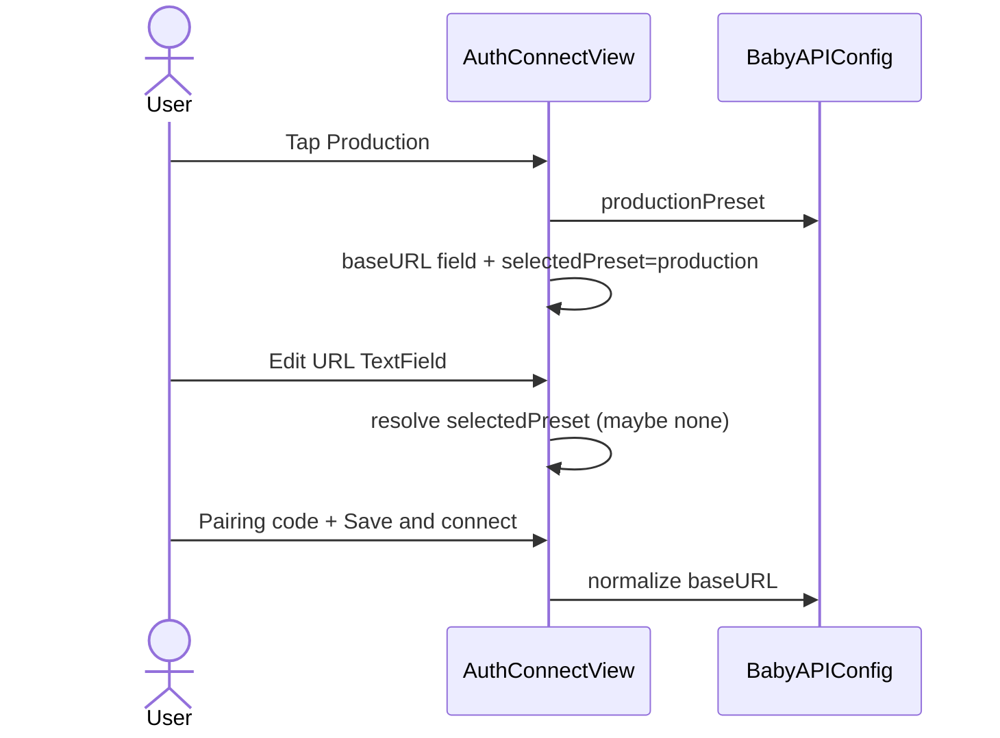

# Design: Connect URL input + Local/Production active state

**Mode:** simple  
**Has API:** no · **Has DB:** no  
**Note:** User Decision 1 (2026-09-26): show input field for user input. Prior active-state lock kept as secondary.

## Decision 1: how user sets / sees the API origin

### Option 1 — Always-visible URL TextField + preset chips (chosen)

**What it is:** Primary Connect surface shows an editable **API URL** `TextField`. Local / Production fill that field and show selected chrome. User can type or paste any `http(s)` origin. Advanced keeps **token paste only** (no second URL field).

**Example:** Tap Local → field shows `http://127.0.0.1:3000`, Local accent-selected. User edits field to `https://app.example.com` → both presets idle (`.none`).

**Pros:** Visible feedback when presets fire; user can enter Production host without digging into Advanced; matches “input field for user input”.  
**Cons:** Slightly taller Connect scroll on Watch.

### Rejected alternative

Active chips only (no primary URL field) — user cannot see/edit origin without Advanced; fails Decision 1.

### Recommendation

**Pick Option 1** (user Decision 1).

## Chosen design

1. **Order:** title → Local|Production (active chrome) → **URL TextField only when Production selected** → pairing code → error → Save & connect → Advanced (token) → guide.
2. **On load (locked):** `selectedPreset = .local`, `baseURL = localPreset`, URL field **hidden**.
3. **Local tap:** select Local, set `baseURL = localPreset`, **hide** URL field.
4. **Production tap:** select Production, **reset URL field to empty**, show URL field for user input.
5. Typing in URL field keeps Production selected — field stays visible until Local is tapped.
6. Advanced: token only; uses current `baseURL`.
7. Redeem / save: `normalize(baseURL)`.

## System design

### Overview

**N/A** — client-only Connect chrome; no new API/DB boundary.

## Design patterns used

### Pattern 1 — Pure selection resolver

- **What:** Map normalized URL → `.local` / `.production` / `.none`.
- **How:** Compare to presets; else `.none`.
- **Why:** Unit-test without SwiftUI.
- **Best practices:** One helper used on appear, after preset tap, and on field change.

### Pattern 2 — Care chip selected chrome

- **What:** Accent vs surface for Local/Production.
- **How:** Same as `CareMlAmountGrid`; `.buttonStyle(.plain)`.
- **Why:** Consistent Watch language.
- **Best practices:** Nested radius; hairline when idle.

## Sequence diagram

## API contracts

N/A — Has API = no.

## Database contracts

N/A — Has DB = no.

## Example queries / documents

N/A.

## UI / UX / mobile

- URL field always visible (not only under Advanced).
- Presets fill the field; active chip state updates.
- Typing a custom URL clears preset selection when it matches neither.
- Advanced = token paste path only.
- watchOS: `textInputAutocapitalization(.never)` on URL; pairing code stays characters.

## OWASP (Top 10)

| Area | Notes |
|------|--------|
| A01 Broken access | N/A |
| A02 Crypto | Token still Keychain; not logged |
| A03 Injection | URL still through `normalize` before save/redeem |
| A04 Insecure design | User-typed origin is intentional; validate http(s) |
| A05 Misconfig | No secrets in URL field |
| A06 Vulnerable components | N/A |
| A07 Auth failures | Unchanged redeem errors |
| A08 Data integrity | Unchanged |
| A09 Logging | Do not log token |
| A10 SSRF | Client-chosen origin only; still http/https + host required |

## Aggressive challenges

- Duplicate URL in Advanced — removed (token only).
- Empty URL + code redeem — keep existing fallback to `productionPairingOrigin` or show validate error; Design: prefer validate field before redeem when code present (use normalize; if nil show “Enter a valid http(s) URL”).

## Has API / Has DB

- **Has API:** no  
- **Has DB:** no
