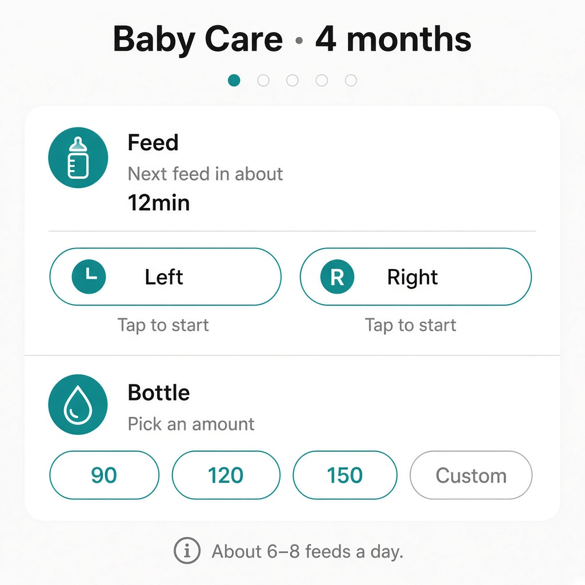
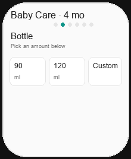
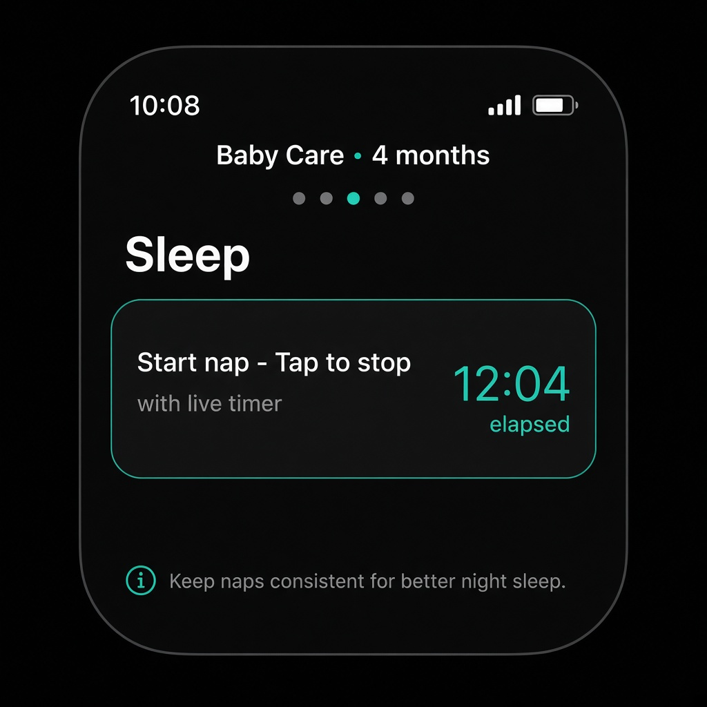

# UI concept (UI/UX designer): watch-feed-pump-merge

**Result:** done
**Updated:** 2026-09-24
**Has UI:** yes

## Sources followed

| Source | Applied? | Notes |
|--------|----------|-------|
| Project DESIGN_GUIDE / AGENTS UI | missing | Watch app; follow existing Watch tokens (`BabyPalette`, `CareControls`) |
| `clean-minimal-ui` skill | yes | Teal accent, quiet hierarchy, no extra chrome |
| `frontend-ui-engineering` skill | yes | Scroll, hit targets, one job per page |
| Existing UI patterns in repo | yes | `CarePages.swift`, `CareControls.swift`, `BabyHomeView.swift` |

## Concept depth

**full** — two primary surfaces (Feed merged, Pump merged) + scroll.

## Align with Gate A (80/20)

| Item | From 01a / idea | How concept honors it |
|------|-----------------|------------------------|
| Important info/action #1 | Timed chips above fold | Breast L/R (Feed) / Pump L/R/Both (Pump) first in ScrollView |
| Important info/action #2 | Amount chips same page | Bottle / pump ml grid next; short Crown scroll OK |
| Secondary (expand / modal / menu) | Custom ml | Keep `CustomMlPicker` sheet |
| Top user journey | Fewer swipes | Remove Bottle + Pump amount from TabView strip |
| Sensible defaults | Aliases + page order | Feed → Sleep → Diaper → Pump → Last care |

## Screen / surface map

| Surface | Purpose | Primary actions |
|---------|---------|-----------------|
| Feed (merged) | Breast + bottle in one swipe | L/R timers; ml chips + Custom |
| Pump (merged) | Timers + amount in one swipe | L/R/Both; ml chips + Custom |
| Sleep / Diaper / Last care | Unchanged this pass | Existing |

## UI reference images (required for Gate A2; confirm at Gate B without re-show)

**Fidelity note:** Live Watch chrome today is **no app title**, `CareSectionHeader` + chips from `CareControls` (see code). Prior workflow images below are **pattern / concept** refs (web stack + older concept drafts). They show **merge intent** (timers then amounts stacked). **Replace with Watch simulator screenshots after Build** before Gate C (or earlier if Gate B needs reconfirm).

| Surface | Variant | File path | Source | Shown at Gate A2? | Confirmed at Gate B? |
|---------|---------|-----------|--------|-------------------|----------------------|
| Stack pattern (web Feed+Bottle) | light | `ui-refs/01-web-feed-bottle-stack-pattern-light.png` | prior-ui-ref (my-apps / early home) | yes | |
| Feed current (split) | light | `ui-refs/02-feed-current-split-light.png` | prior-ui-ref / concept-draft | yes | |
| Bottle current (split) | light | `ui-refs/03-bottle-current-split-light.png` | prior-ui-ref / concept-draft | yes | |
| Watch-ish chrome sample (Sleep) | dark | `ui-refs/04-watch-chrome-sleep-dark.png` | prior-ui-ref | yes | |

**Replace-after-build:** Capture Watch sim Feed (scrolled top + scrolled to bottle) and Pump (timers + amounts) → overwrite or add `05`/`06` real screenshots.

Markdown previews:

## Layout concept (plain words)

- **Hierarchy / eye flow:** Header (lead + quiet detail) → timed chips → amount grid → one footer tip. Vertical `ScrollView` so dense content does not clip.
- **Core vs secondary:** Timers + recommended ml on-page; Custom in sheet; no second horizontal page for bottle/pump-amount.
- **Components to reuse:**

| Component / pattern | Where it already lives | Use for |
|---------------------|------------------------|---------|
| `TimedCareChip` | `CareControls.swift` | Breast / pump sides |
| `CareMlAmountGrid` | `CareControls.swift` | Bottle + pump ml |
| `CareSectionHeader` / `CareFooterSlot` | `CareControls.swift` | Page chrome |
| Page-style `TabView` | `BabyHomeView.swift` | Horizontal pages only (5 after merge) |

## Watch-specific layout (target — matches code chrome, not web card mock)

**Feed page (scrollable):**
1. Header: “Feed” + `feedHeaderDetail`
2. Breast L | R chips
3. Bottle ml grid (existing chips + Custom) — may need Crown scroll
4. One footer (feed tip / recovery — same footer owner rules as today)

**Pump page (scrollable):**
1. Header: “Pump” + `pumpTip`
2. Pump L | R row + Both
3. Pump ml grid + Custom
4. One footer (drop “Swipe for amounts.”)

**Strip after merge:** Feed · Sleep · Diaper · Pump · Last care

## States

| State | Behavior |
|-------|----------|
| Loading | N/A (sample / local) |
| Empty | Chips idle; tips as today |
| Error | Footer fail / recovery unchanged |
| Success | Done flash on ml / diaper as today |
| Running timer | Timed chips keep current phase UI |

## Interaction notes

- Horizontal page swipe stays for TabView; vertical scroll only **inside** Feed and Pump.
- Prefer scroll that does not steal horizontal swipe (Watch default ScrollView in page TabView — verify in Build).
- Deep links: `bottle` → Feed; `pump-amount` → Pump (aliases).
- Sleep / Diaper / Last care: no scroll required this pass (Open question closed: only Feed + Pump).

## Accessibility / responsive

- Keep ≥ ~44pt chip hit height.
- Dynamic Type / small faces: scroll must reach Custom.
- VoiceOver order: header → timers → amounts → footer.

## Open UI questions

1. None blocking Gate A2 — footer tip owner can be fixed in Design (recommend feed tip on Feed; pump tip on Pump).

## Result

**done** — layout concept + prior refs for Gate A2. Human must approve **merge + scroll intent**; accept that real Watch screenshots replace concept/web refs after Build.
