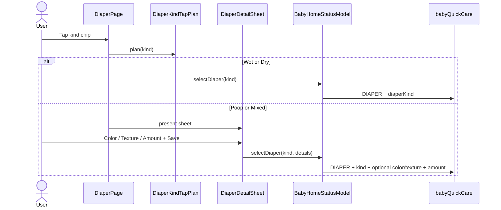

# Design: Center picker title + diaper detail sheet

**Mode:** simple  
**Has API:** no · **Has DB:** no  
**Note:** main-thread fallback — usage limit after Design Task retry

## Decision 1: diaper detail density on Watch

### Option 1 — Full parity chips (chosen)

**What it is:** Poop/Mixed open a scrollable sheet with the same color / texture / amount enums as my-apps; Wet/Dry stay one-tap. Picker title centered.

**Example:** Tap Poop → sheet (Color, Texture, Amount default Medium) → Save → `babyQuickCare` with `diaperKind: dirty` + optional color/texture + `diaperAmount`.

**Pros:** Matches web mental model; reuses existing GraphQL fields.  
**Cons:** Tall sheet on Watch (scroll OK).

### Rejected alternative

Amount-only sheet (skip color/texture) — faster on wrist but not “same as my-apps”.

### Recommendation

**Pick Option 1.**

## Chosen design

1. **Picker title:** `CustomMlPicker` title `Text` → `.frame(maxWidth: .infinity, alignment: .center)` (both Bottle + Pump sheets).
2. **Pure plan helper** (Swift mirror of `planBabyDiaperKindTap`):
   - Wet/Dry → `.instantSave`
   - Poop (`dirty`)/Mixed → `.openSheet` with defaults color/texture `nil`, amount `.medium`
3. **DiaperPage:** grid `onSelect` uses plan — instant → `model.selectDiaper(kind)`; openSheet → present `.sheet` with kind.
4. **DiaperDetailSheet:** ScrollView; chip rows for Color / Texture / Amount; optional chips toggle off; red-flag / caution captions (short EN copy, same meaning as web); Cancel dismisses without save; Save calls model with details.
5. **Model:** `selectDiaper(_ kind:details:)` — Wet/Dry path unchanged; detail path adds `diaperColor` / `diaperTexture` / `diaperAmount` keys when present; amount always sent for dirty/mixed (default medium). Sample mode: flash done only.
6. **Enums:** mirror my-apps API strings (`yellow`, `brown`, … / `soft`, … / `smear|medium|blowout`).

## System design

### Overview

**N/A** — client Watch UI + existing `babyQuickCare` action fields; no new service boundary.

## Design patterns used

### Pattern 1 — Pure tap plan + save mutation helpers

- **What:** Plan / draft → mutation without SwiftUI.
- **How:** `DiaperKindTapPlan` + `diaperSheetSaveAction(kind:draft:)` mirroring my-apps helpers.
- **Why:** Unit-test Wet/Dry vs Poop/Mixed without UI.
- **Best practices:** Keep API string values identical to web enums.

### Pattern 2 — Page-owned sheet state

- **What:** `@State` on `DiaperPage` for sheet presentation (like Bottle/Pump custom sheets).
- **How:** `.sheet` + detail view; model only saves.
- **Why:** Matches existing Watch care sheet pattern.
- **Best practices:** Dismiss on Save; Cancel clears draft.

## Sequence diagram



## API contracts

N/A new contracts. **Uses existing** live action keys already accepted by my-apps:

| Key | When |
|-----|------|
| `kind` | `"DIAPER"` |
| `diaperKind` | `wet` / `dirty` / `mixed` / `dry` |
| `diaperColor` | optional; dirty/mixed only |
| `diaperTexture` | optional; dirty/mixed only |
| `diaperAmount` | dirty/mixed on sheet Save (default `medium`) |

## Database contracts

N/A — Has DB = no.

## Example queries / documents

Existing mutation document unchanged (`BabyGraphQLDocuments` quick care). Variables example (conceptual):

```json
{
  "input": {
    "clientRequestId": "…",
    "action": {
      "kind": "DIAPER",
      "diaperKind": "dirty",
      "diaperColor": "yellow",
      "diaperAmount": "medium"
    }
  }
}
```

## UI / UX / mobile

- Picker title centered on Bottle/Pump custom sheets.
- Diaper grid unchanged; secondary detail in sheet (80/20).
- Watch: scrollable sheet; chip hit targets ≥ care chip height; Save primary.
- English short labels for sheet (parity meaning with web `diaper.*` keys).

## OWASP (Top 10)

| Area | Notes |
|------|--------|
| A01 Broken access | Unchanged token gate |
| A02 Crypto | Token Keychain; unchanged |
| A03 Injection | Enum-only chips → known API strings |
| A04 Insecure design | Optional medical warn copy; still allows Save (parity with web) |
| A05 Misconfig | N/A |
| A06 Vulnerable components | N/A |
| A07 Auth failures | Unchanged reconnect / fail chrome |
| A08 Data integrity | Idempotent clientRequestId unchanged |
| A09 Logging | Do not log token; avoid PII in logs |
| A10 SSRF | N/A |

## Aggressive challenges

- “All four kinds open sheet” — rejected; breaks Wet/Dry speed + web S1.
- Multi-step wizard — more taps; reject.
- New GraphQL fields — unnecessary; server already accepts detail.

## Has API / Has DB

- **Has API:** no  
- **Has DB:** no

## Clear for Gate B?

Yes — after design-review + TDD review.
